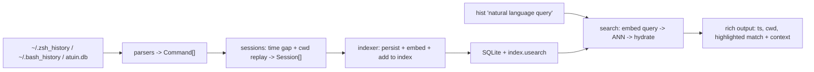

# Architecture

This document records the architecture decisions for `hist` and the reasoning
behind each one. It is the contract that the implementation must follow.

## Goal recap

A local-first, privacy-preserving CLI that searches shell history by
meaning/intent. Group history into time/directory "sessions", embed each session
locally with a small sentence-embedding model, store vectors in a local on-disk
index, and do nearest-neighbour search at query time. No cloud, no API keys, no
data leaves the machine.

---

## Decision 1: Language -- Python

**Chosen: Python.** Rust was the alternative.

The performance requirements are demanding on paper (index 10k commands in <30s;
query <1s at 100k+ sessions) but the actual hot paths are all C/native code
regardless of the host language:

- Embedding runs in ONNX Runtime (C++).
- Nearest-neighbour search runs in usearch (C++) or numpy (BLAS).

The Python layer only does parsing, grouping, and SQLite I/O, none of which is a
bottleneck at this scale. Crucially, **we embed per *session*, not per command**:
10k commands collapse to a few hundred to low-thousand sessions, so we run far
fewer (and batched) encodes than the raw command count suggests.

Python also wins on iteration speed and ecosystem (`fastembed`, `usearch`,
`sentence-transformers`) and is effectively required by Hard Requirement #7
(`pip install hist`). Rust would give a single static binary and marginally
faster cold start, but offers no help meeting the latency targets, which are
already met. Rust is noted in `FUTURE_IDEAS.md` as a future distribution path.

## Decision 2: Embedding model & runtime -- all-MiniLM-L6-v2 on onnxruntime

**Chosen: `sentence-transformers/all-MiniLM-L6-v2` (384-dim) run as an ONNX
graph directly through `onnxruntime` + `tokenizers`, on CPU, fully offline.**

The model itself is confirmed as the right choice for short, terse command-line
text:

- 384 dimensions, ~90MB ONNX on disk, single-digit-ms CPU encode when batched.
- General-purpose semantic similarity model that handles short text well, which
  matches our session documents (a handful of command lines plus the directory
  name).

**Runtime decision and the reason it changed.** The spec named
`sentence-transformers`, which depends on PyTorch (200MB+ even CPU-only) and
undercuts the lightweight promise. We first adopted `fastembed` (same model,
ONNX, no PyTorch). However, **measured on the target CPU fastembed delivered
only ~28 texts/sec**, which blew the budgets (indexing 10k commands took ~34s vs
the 30s limit, and a query took ~2-3s vs the 1s limit). Profiling showed the
same ONNX graph driven *directly* through `onnxruntime` -- with
`graph_optimization_level=ORT_ENABLE_ALL` and `intra_op_num_threads = cpu_count`
-- runs at **~600 texts/sec (~20x faster)** and produces **bit-for-bit identical
vectors (cosine 1.0)**. So the embedder now drives onnxruntime itself:
`tokenizers` for tokenization, the ONNX `model.onnx` for inference, mask-weighted
mean pooling, then L2 normalization (exactly matching all-MiniLM-L6-v2). The
ONNX weights + tokenizer are fetched once via `huggingface_hub` and cached.

This is precisely the payoff of hiding the model behind the `Embedder` ABC
(`encode(texts) -> np.ndarray`, rows L2-normalized): the runtime was swapped with
zero changes to the indexer, search, or CLI. Swapping forward to an
instruction-tuned asymmetric model (e5/bge) remains a one-class change. See
`BENCHMARKS.md` for the before/after numbers.

Known limitation: queries are natural language ("how did I fix the nginx issue")
while documents are commands. MiniLM is roughly symmetric and works well enough
for the MVP; asymmetric query/passage models are listed in `FUTURE_IDEAS.md`.

## Decision 3: Vector storage -- usearch

**Chosen: `usearch`**, behind the `VectorIndex` ABC. Candidates compared for the
10k-100k+ vector scale:

| Option | Verdict | Reasoning |
|---|---|---|
| `sqlite-vss` | Rejected | Effectively unmaintained (superseded by `sqlite-vec`); relies on loadable SQLite extensions with spotty/fragile wheels, and is weak on Python 3.13. Install friction directly threatens the clean `pip install` requirement. |
| `hnswlib` | Viable, not chosen | Fast, mature HNSW, but forces us to hand-roll the key->metadata mapping and index persistence ourselves -- more glue, more ways to desync the index from the DB. |
| `usearch` | **Chosen** | Single pip wheel across manylinux/macOS/Windows; HNSW *and* exact search; cosine metric; memory-mapped single-file save/load; integer keys map directly to our SQLite `session.id`; scales far past 100k. |

**Scale sanity check:** at 100k vectors x 384 float32 (~150MB) even a brute-force
numpy cosine scan is ~tens of milliseconds, so the <1s query target is met *even
without* an ANN index. usearch is chosen not because ANN is strictly required at
this scale, but for clean single-file persistence and headroom to grow. Because
the store is behind `VectorIndex`, a numpy brute-force backend remains a trivial
drop-in fallback.

The vector file (`index.usearch`) holds vectors keyed by `session.id`; all
session metadata and command text lives in SQLite. The two are linked solely by
that integer key.

## Decision 4: Session-grouping algorithm -- time gap + reconstructed cwd

**Chosen: split on time gap OR working-directory change, with the working
directory reconstructed from the command stream.**

The spec's heuristic (commands within ~5 min AND in the same directory form one
session) is sound, but it hits a hard reality: **plain `~/.zsh_history` and
`~/.bash_history` do not record a working directory per command.** Only atuin
stores cwd. So the directory half of the heuristic is not directly available for
the primary data sources.

Resolution:

1. **Reconstruct cwd by replaying directory changes.** Walk commands in order,
   maintaining a running cwd. Update it on `cd`, `pushd`, `popd`, and bare `cd`
   (-> home). Resolve relative paths against the current cwd; when a target
   cannot be resolved (e.g. `cd "$VAR"`, `cd $(...)`), keep the previous cwd and
   mark uncertainty rather than guessing.
2. **Use real cwd when available.** atuin records the actual cwd, so when reading
   from atuin we use it directly instead of reconstructing.
3. **Boundary rule.** Start a new session when the inter-command time gap exceeds
   `session_window_seconds` (default 300) **or** (if `split_on_cwd_change`) the
   cwd changes. Both knobs live in `Config`.
4. **Timestamp-less sources.** bash without `HISTTIMEFORMAT` has no timestamps;
   there we fall back to splitting on cwd change in file order only.

This keeps the spec's intent (sessions = "what you were doing in one place around
one time") while being honest about what the data actually contains.

## Decision 5: Extensibility guardrails (applied, not over-built)

- `Embedder` ABC wraps the model so it can be swapped without touching callers.
- `VectorIndex` ABC wraps the store so usearch/hnswlib/numpy are interchangeable.
- `schema_version` is written to the SQLite `meta` table from day one (currently
  `1`).
- All tunables (session window, cwd-split toggle, model name, dim, data paths,
  top-k) are centralized in a single `Config` object, not scattered constants.
- We deliberately do **not** build plugin systems, multi-backend config, or
  speculative feature flags. Anything tempting goes to `FUTURE_IDEAS.md`.

---

## Data model

SQLite (`hist.db`) holds metadata; `index.usearch` holds vectors keyed by
`session.id`.

- `meta(key, value)` -- includes `schema_version`.
- `sessions(id, start_ts, end_ts, cwd, command_count, doc_text)`.
- `commands(id, session_id, seq, source, ts, duration, exit_code, cwd, raw_cmd)`.

`Session.to_document()` is the single source of truth for the embedded text:
the directory basename followed by the session's commands, in order.

## Pipeline

## Module boundaries

- `hist/config.py`, `hist/models.py`, `hist/db.py`, `hist/interfaces.py` —
  configuration, data model, persistence, and swappable subsystem interfaces.
- `hist/parsers/{base,zsh,bash,atuin}.py` — history file parsers.
- `hist/sessions.py` — session grouping (time gap + cwd reconstruction).
- `hist/embedder.py` — `OnnxEmbedder(Embedder)` (MiniLM via onnxruntime).
- `hist/index.py` — `UsearchIndex(VectorIndex)`.
- `hist/indexer.py` — parse → group → persist → embed → index orchestration.
- `hist/search.py` — query → embed → ANN → length normalization → gated hybrid
  RRF reranking → hydrate → per-command match highlighting.
- `hist/cli.py`, `hist/output.py` — CLI entry point and rich formatting.
- `tests/synthetic.py` — synthetic multi-topic history generator (tests + bench).
- `eval/` — offline search-quality evaluation harness (not shipped in the wheel).
- `benchmarks/` — performance benchmark script (not shipped in the wheel).

## Performance plan vs requirements

- **Index 10k commands < 30s:** embedding is per-session (far fewer than 10k) and
  batched through ONNX; SQLite writes are batched in a transaction.
- **Query < 1s at 100k+ sessions:** one query encode (~ms) + usearch search
  (sub-ms to low-ms); brute-force numpy would still be tens of ms.

Real measured numbers are recorded in `BENCHMARKS.md`.
